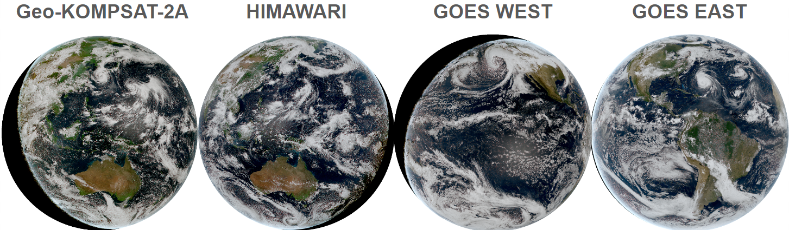

# Geostationary satellite Cookbook

[](https://github.com/ProjectPythia/cookbook-template/actions/workflows/nightly-build.yaml)
[](https://binder.projectpythia.org/v2/gh/ProjectPythia/cookbook-template/main?labpath=notebooks)
[](https://zenodo.org/badge/latestdoi/475509405)


This **"Pythia Cookbook"** was started during the **Project Pythia June 11-14 2024 in Boulder, CO at the NCAR Mesa Lab**. The **"COOKBOOK GEOSAT"** aims to provide a comprehensive guide for utilizing Satpy to analyze geostationary satellite data of the sensor Advanced Baseline Imager ([ABI](https://www.goes-r.gov/spacesegment/abi.html)) on [GOES-R](https://www.goes-r.gov) (west and east), sensor Advanced Himawari Imager ([AHI](https://www.data.jma.go.jp/mscweb/en/himawari89/space_segment/spsg_ahi.html)) on [HIMAWARI](https://www.jma.go.jp/jma/jma-eng/satellite/himawari89.html), and sensor Advance Meteorological Imager (AMI) on [Geo-KOMPSAT-2A](https://nmsc.kma.go.kr/enhome/html/base/cmm/selectPage.do?page=satellite.gk2a.intro) (GK2A). [Satpy](https://satpy.readthedocs.io/en/stable/) is a powerful Python library specifically designed for processing and analyzing satellite data, offering capabilities for data visualization, manipulation, and analysis.



## Motivation

<p>
   
Public access to NOAA's geostationary satellite data, including GOES-16, GOES-17, and GOES-18, is made possible through the NOAA Open Data Dissemination <a href="https://www.noaa.gov/information-technology/open-data-dissemination">NODD</a> Program on commercial cloud platforms like Microsoft Azure, Amazon Web Services, and Google Cloud Platform. Amazon Web Services also hosts data from two other geostationary satellites HIMAWARI and Geo-KOMPSAT-2A. NODD's partnerships with top cloud providers enable near real-time access to to all these satellites, as well as long archives.</p>  
<p>
Global weather, climate, and environmental phenomena monitoring is greatly aided by geostationary satellites such as GOES-R, HIMAWARI, and GK2A. The need for thorough tools and resources to efficiently analyze and interpret satellite data is growing as the use of such data for scientific research, weather forecasting, and environmental monitoring grows. 
</p>  

<p>
   
A Python library called Satpy was created specifically for handling data from satellite instruments that observe the Earth. Remote-sensing data can be read, modified, and written with it. Geophysical parameters can be converted from various file formats into Xarray DataArray and Dataset classes, which allow for easy integration with other scientific Python libraries. Satpy combines data from various instrument bands or products to make it easier to create RGB images and composite types. In order to enhance the quality and usefulness of images, it has features for atmospheric corrections and visual improvements. Several formats, including PNG, GeoTIFF, and CF standard NetCDF files, are available for saving output data. Users can resample data to geographic projected grids (areas) using Satpy as well.Although there are already guides and tutorials available for using Satpy, there isn't much thorough advice that is tailored specifically to the analysis 
of the three geostationary satellites that can be accessed freely from AWS buckets <a href="https://registry.opendata.aws/noaa-goes/">AWS_GOES-R</a>, <a href="https://registry.opendata.aws/noaa-himawari/">AWS_HIMAWARI</a>, and <a href="https://registry.opendata.aws/noaa-gk2a-pds/">AWS_GK2A</a>. Users can gain access to structured tutorials, detailed instructions, and sample workflows that are specifically designed to meet the needs and distinctive features of these satellites by creating a cookbook specifically for them.</p> 


## Authors

[jhbravo](jhbravo), [Second Author](@second-author), etc. _Acknowledge primary content authors here_

### Contributors

<a href="https://github.com/ProjectPythia/cookbook-template/graphs/contributors">
  
</a>


## Structure
This development cookbook serves as an example of how to gather, handle, and present various geostationary satellite data types.

### Foundations
The ABI on the GOES-R series, the AHI on the Himawari satellites, and the AMI on the Geo-KOMPSAT-2A satellites all provide multi-channel visibility through their respective 16 spectral bands.

These sensors have several similarities in their spectral band configurations:

- All three instruments have bands covering the visible, near-infrared, and infrared portions of the electromagnetic spectrum.
- The central wavelengths of the spectral bands are comparable across the ABI, AHI, and AMI, enabling similar meteorological and environmental observations.
- The spatial resolutions of the bands also exhibit similarities, with the visible bands typically having finer spatial resolution

### Example workflows

Several notebooks with the following structure can be found in the notebooks directory:

- [00_geosat_explaining_steps.ipynb](notebooks/00_geosat_explaining_steps.ipynb):: provides a detailed explanation on how to download data and use Satpy to display it.

Given that you have read the 00_geosat_explaining_steps.ipynb and have a basic understanding of how to use Satpy, the following notebooks are designed without providing an explanation of the various sensors on each satellite.
- [99_auxiliar_dowloading.ipynb](notebooks/99_auxiliar_dowloading.ipynb): In order to run the subsequent notebooks, data must be downloaded from this notebook. 
- [01_geosat_ABI_GOES_east.ipynb](notebooks/01_geosat_ABI_GOES_east.ipynb): notebook to read ABI sensor data locally on GOES-east
- [02_geosat_ABI_GOES_west.ipynb](notebooks/02_geosat_ABI_GOES_west.ipynb): notebook to read ABI sensor data locally on GOES-west
- [03_geosat_AHI_HIMAWARI.ipynb](notebooks/03_geosat_AHI_HIMAWARI.ipynb): notebook to read AHI sensor data locally on HIMAWARI
- [04_geosat_AMI_GK2A.ipynb](notebooks/04_geosat_AMI_GK2A.ipynb): notebook for reading AMI sensor data locally on GeoKomposat

## Running the Notebooks

You can either run the notebook using [Binder](https://binder.projectpythia.org/) or on your local machine.

### Running on Binder

The simplest way to interact with a Jupyter Notebook is through
[Binder](https://binder.projectpythia.org/), which enables the execution of a
[Jupyter Book](https://jupyterbook.org) in the cloud. The details of how this works are not
important for now. All you need to know is how to launch a Pythia
Cookbooks chapter via Binder. Simply navigate your mouse to
the top right corner of the book chapter you are viewing and click
on the rocket ship icon, (see figure below), and be sure to select
“launch Binder”. After a moment you should be presented with a
notebook that you can interact with. I.e. you’ll be able to execute
and even change the example programs. You’ll see that the code cells
have no output at first, until you execute them by pressing
{kbd}`Shift`/+{kbd}`Enter`. Complete details on how to interact with
a live Jupyter notebook are described in [Getting Started with
Jupyter](https://foundations.projectpythia.org/foundations/getting-started-jupyter.html).

### Running on Your Own Machine

If you are interested in running this material locally on your computer, you will need to follow this workflow:

(Replace "cookbook-geosat" with the title of your cookbooks)

1. Clone the `https://github.com/ProjectPythia/cookbook-geosat` repository:

   ```bash
    git clone https://github.com/ProjectPythia/cookbook-geosat.git
   ```

1. Move into the `cookbook-geosat` directory
   ```bash
   cd cookbook-geosat
   ```
1. Create and activate your conda environment from the `environment.yml` file
   ```bash
   conda env create -f environment.yml
   conda activate cookbook-geosat
   ```
1. Move into the `notebooks` directory and start up Jupyterlab
   ```bash
   cd notebooks/
   jupyter lab
   ```
